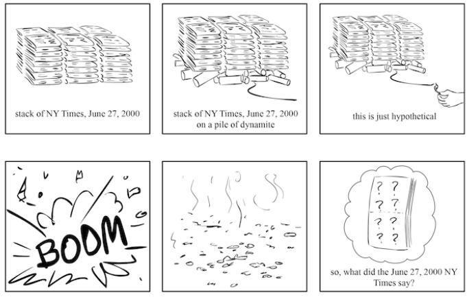
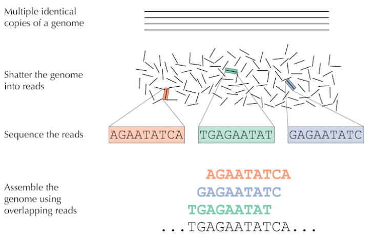

## El periódico explosivo

Imagina que apilamos cien copias de la edición del 27 de junio de 2000 del New York Times sobre una pila de dinamita y luego encendemos la mecha y estos explotan de manera caricaturesca en trozos diminutos. ¿Cómo podríamos usar los pequeños fragmentos de periódico para averiguar cuáles eran las noticias el 27 de junio de 2000? A este extraño enigma lo llamaremos el Problema del Periódico.

  

El Problema del Periódico es incluso más difícil de lo que parece. Debido a que teníamos varias copias de la misma edición del periódico y porque sin duda perdimos alguna información en la explosión, no podemos simplemente pegar una de las copias del periódico de la misma manera que armaríamos un rompecabezas. 

Pero, te preguntarás, ¿qué tienen que ver los periódicos explosivos con la biología? Determinar el orden de las bases en un genoma, o la secuenciación del genoma, presenta una tarea fundamental en la bioinformática... pero que se enfrenta a problemas mucho más difíciles.

## ¡Los virus mandan!

El primer genoma secuenciado, perteneciente a un fago bacteriano φX174, tenía sólo 5,386 nucleótidos y fue completado en 1977 por Frederick Sanger. Cuatro décadas después de este descubrimiento galardonado con el Premio Nobel Debido a la disminución del costo de la secuenciación, ahora tenemos miles de genomas secuenciados.

## La secuenciación y el ensamblaje

El método tradicional para secuenciar genomas se describe de la siguiente manera. Tomamos una pequeña muestra con copias de material genético, utilizamos métodos bioquímicos para romper el DNA en fragmentos y luego secuenciamos estos fragmentos para producir lecturas.

  

La dificultad radica en que no ssabemos de dónde provienen las lecturas... igual al Problema del Periódico.

Aunque los investigadores han secuenciado muchos genomas, un genoma gigante como el de ***Amoeba dubia*** aún está fuera del alcance de las tecnologías modernas de secuenciación. Podrías pensar que la barrera para secuenciar tal genoma sería experimental, pero eso no es cierto; los biólogos pueden generar fácilmente suficientes lecturas para analizar un genoma grande, pero el ensamblaje de estas lecturas sigue presentando un gran desafío computacional.

Aunque... en el caso de los virus, las principales limitaciones suelen estar del lado experimental. Por ejemplo, el virus que provocó una de las últimas epidemias de hepatitis no ha podido ser secuenciado... de hecho, aún tenemos dudas sobre el tipo de arquitectura genómica que posee, si es (+)ssRNA (-)ssRNA o dsRNA.
