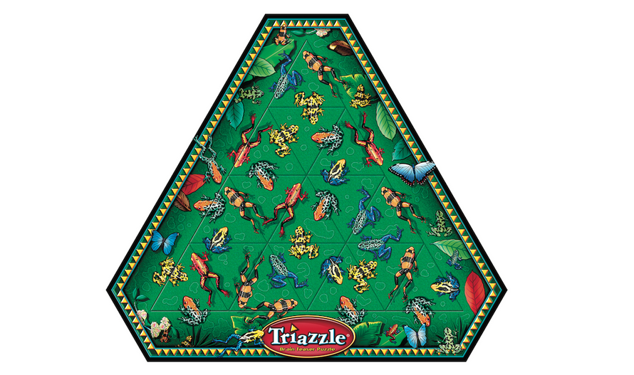

## El ensamblaje del genoma como un problema computacional

Para poder decidir correctamente los métodos de ensamblaje, tomaremos un momento para discutir algunas complicaciones prácticas que hacen que el ensamblaje del genoma sea más difícil que el Problema del Periódico.

 * En primer lugar, el DNA (y en los virus a veces el RNA) es de doble cadena, y no tenemos forma de saber a priori de qué cadena proviene una determinada lectura, lo que significa que no sabremos si usar una lectura o su complemento reverso. 

 * En segundo lugar, los errores de secuenciación complican el ensamblaje del genoma porque nos impiden identificar todas las lecturas superpuestas. 
 
  * En tercer lugar, algunas regiones del genoma pueden no estar cubiertas por ninguna lectura, lo que hace imposible reconstruir todo el genoma.

## Reconstrucción de cadenas a partir de k-mers

Ahora estamos listos para definir un problema computacional que modele el ensamblaje del genoma. Dada una cadena de texto, su composición de k-mers, es la colección de todas las substrings de k-mers. Por ejemplo,

```{note}
Composition3(TATGGGGTGC) = {ATG, GGG, GGG, GGT, GTG, TAT, TGC, TGG}.
```
... Encontrar esta composicion es un ejercicio sencillo, pero para modelar el ensamblaje del genoma, necesitamos resolver su problema inverso. Reconstruir una cadena a partir de su composición de k-mers. La tarea de nuestros ensambladores es la siguiente:

    Entrada: Una coleccion de k-mers
    Salida: Una cadena de texto Text con una composición de k-mers compatible

Consideremos el siguiente ejemplo de una composición de 3-mers:

```{note}
AAT   ATG   GTT   TAA   TGT
```
La forma más natural de resolver el Problema de Reconstrucción de la Cadena es imitar la solución del Problema del Periódico y "conectar" un par de k-mers si se superponen en k-1 símbolos. Para el ejemplo anterior, es fácil ver que la cadena debe comenzar con TAA porque no hay ningún 3-mer que termine en TA. Esto implica que el próximo 3-mer en la cadena debe comenzar con AA. Solo hay un 3-mer que cumple esta condición, AAT:

```{note}
TAA   AAT
```
A su vez, AAT solo puede ser extendido por ATG, que solo puede ser extendido por TGT, y así sucesivamente, lo que nos lleva a reconstruir TAATGTT:
```{note}
TAA    
 AAT   
  ATG  
   TGT 
    GTT
TAATGTT
```
y asi sucesivamente. 

## Ensamblar un genoma viral con dominios duplicados es como un rompecabezas

Una analogía que ilustra la dificultad de ensamblar un genoma con muchos repetidos es el rompecabezas de Triazzle. La gente suele armar rompecabezas conectando piezas que coinciden. Sin embargo, cada pieza en el Triazzle coincide con más de una pieza; en el Triazzle de abajo, cada rana aparece varias veces. Si procedes sin cuidado, entonces probablemente emparejarás la mayoría de las piezas pero no podrás encajar las restantes. Y sin embargo, el Triazzle solo tiene dieciséis piezas, lo que debería hacernos reflexionar sobre cómo ensamblar un genoma a partir de millones de lecturas.


