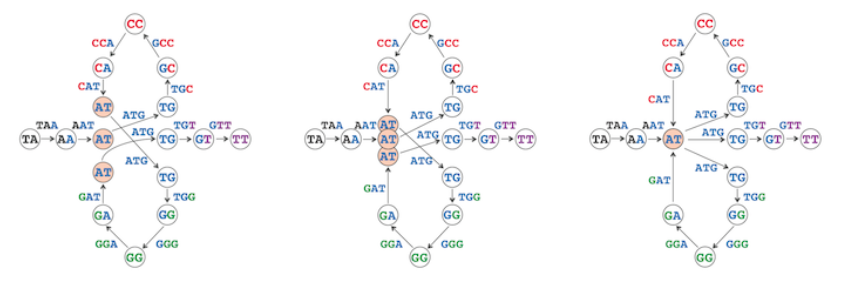
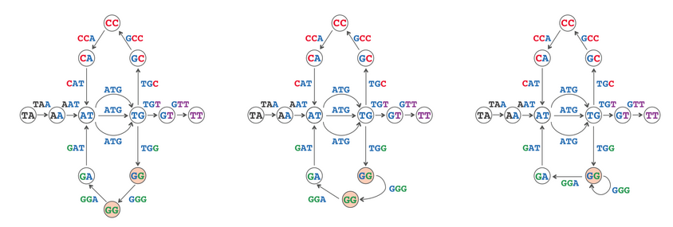

### De una cadena a un grafo

Las lecturas duplicadas de un genoma requieren alguna forma de anticipar la correcta secuencia de ensamblaje.

Consideremos que nuestra secuencia a reconstruir es `TAATGCCATGGGATGTT`.

En la figura siguiente, los k-mers consecutivos en TAATGCCATGGGATGTT están vinculados para formar el camino genómico de esta cadena mostrada como un grafo, una red de nodos conectados por aristas. 


Si seguimos estrictamente la regla de conectar dos k-mers con una flecha cada vez que el sufijo de uno sea igual al prefijo del otro, entonces conectaremos todos los k-mers consecutivos en TAATGCCATGGGATGTT. Sin embargo, debido a que no conocemos este genoma de antemano, terminamos teniendo que conectar muchos otros pares de k-mers también. Por ejemplo, cada una de las tres ocurrencias de ATG debería estar conectada a TGC, TGG y TGT, como se muestra en la figura siguiente.


El grafo muestra todas las conexiones entre los nodos que representan la composición de k-mers de TAATGCCATGGGATGTT. Este grafo tiene quince nodos y 28 aristas. 

Observa que el genoma todavía se puede representar recorriendo las aristas horizontales desde TAA hasta GTT.

## El cruel mundo real

En la secuenciación del genoma de novo, no sabemos de antemano cómo ordenar correctamente las lecturas. ¡El camino del genoma ha desaparecido!


Este camino del genoma puede haber desaparecido a simple vista, pero aún debe estar presente, ya que simplemente hemos reorganizado los nodos del grafo.

Si hubieramos tenido este grafo desde el principio, necesitariamos encontrar un camino a través del grafo visitando cada nodo exactamente una vez; dicho camino "explica" todos los k-mers en la composición de k-mers del genoma por un solo camino.

Encontrar dicho camino es tan difícil como intentar ensamblar el genoma manualmente, el grafo nos proporciona una forma visualmente agradable de visualizar las relaciones de superposición entre las lecturas.


Ahora sabemos que para resolver el problema de reconstruir una cadena, buscamos un camino en el grafo de superposición que visite cada nodo exactamente una vez. Un camino en un grafo que visita cada nodo una vez se llama un camino hamiltoniano.

Nuevamente, representemos el genoma TAATGCCATGGGATGTT como una secuencia de sus k-mers:
```{note}
TAA   AAT   ATG   TGC   GCC   CCA   CAT   ATG   TGG   GGG   GGA   GAT   ATG   TGT   GTT
```
Esta vez, en lugar de asignar estos k-mers a nodos, los asignaremos a aristas, como se muestra en la siguiente figura.


Una vez más, puedes reconstruir el genoma siguiendo este camino de izquierda a derecha, agregando un nuevo nucleótido en cada paso. Dado que cada par de aristas consecutivas representa k-mers consecutivos que se superponen en dos nucleótidos, etiquetaremos cada nodo de este grafo con un 2-mer que represente los nucleótidos superpuestos compartidos por las aristas a ambos lados del nodo. Por ejemplo, el nodo con una arista entrante CAT y una arista saliente ATG se etiqueta como AT.


Nada parece nuevo aquí hasta que comencemos a unir nodos con la misma etiqueta. En la siguiente figura, acercamos cada vez más los tres nodos AT hasta que se han unido en un solo nodo.



### **de Brujin graphs**

Finalmente, unimos los dos nodos etiquetados como GG (GG y GG), lo que produce un tipo especial de arista llamada bucle que conecta GG consigo mismo. El número de nodos en el grafo resultante (mostrado a la derecha a continuación) se ha reducido de 16 a 11, mientras que el número de aristas se ha mantenido igual. Este grafo se llama el grafo de De Bruijn de `TAATGCCATGGGATGTT`.

Observa que el grafo de De Bruijn a continuación tiene tres aristas diferentes que conectan AT con TG (que representan tres copias de la repetición ATG).



Los ensambladores basados en grafos de Brujin operan a partir de la definición de k-mers, que permiten generar un primer grafo global desconectado, que a través de múltiples iteraciones se reduce en tamaño y aumenta su conexión. Los contigs que obtenemos son en esencia, las mejores soluciones a un camino Hamiltoniano en los grafos de De Bruijn.
